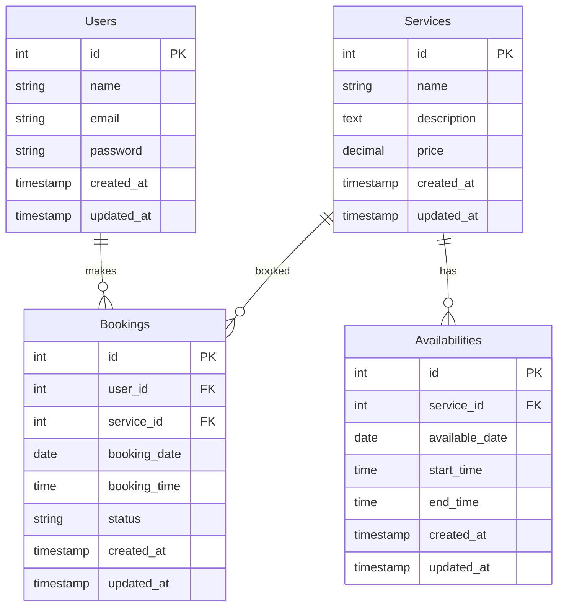

# Sistema de Reserva de Libros

Proyecto desarrollado en Laravel para gestionar reservas de libros.

## Tecnologías

- Laravel
- PHP
- MySQL

## Estado del proyecto

En desarrollo 🚧

## Instalación

Próximamente...

## Diagrama Entidad Relacion

En el siguiente diagrama representa el esquema grafico de las entidades del sistema de reserva de libros.

