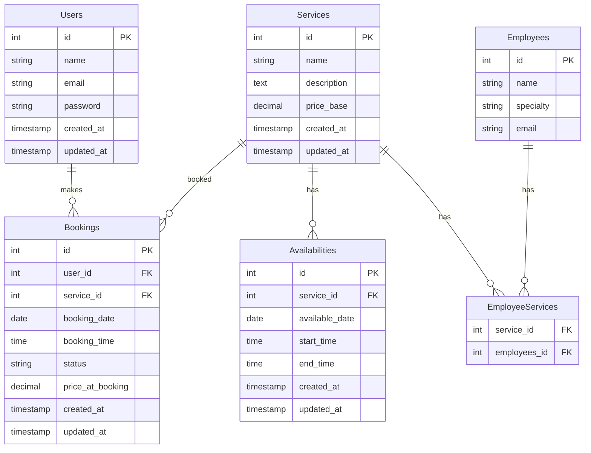
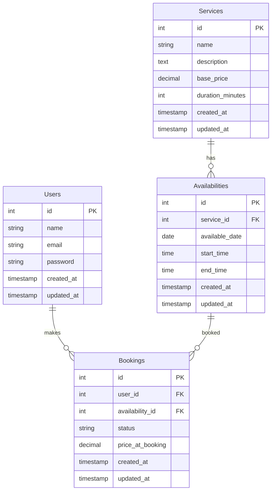

# Sistema de Reserva de Libros

Proyecto desarrollado en Laravel para gestionar reservas de citas medicas.

## Tecnologías

- Laravel
- PHP
- MySQL

## Estado del proyecto

En desarrollo 🚧

## Instalación

Próximamente...

## Diagrama Entidad Relacion

En el siguiente diagrama representa el esquema grafico de las entidades del sistema de reserva de citas medicas.

```mermaid
erDiagram
    Users {
        int id PK
        string name
        string email
        string password
        timestamp created_at
        timestamp updated_at
    }

    Services {
        int id PK
        string name
        text description
        decimal price_base
        timestamp created_at
        timestamp updated_at
    }

    Employees{
        int id PK
        string name
        string specialty
        string email
    }

     EmployeeServices{
        int service_id FK
        int employees_id FK
    }

    Bookings {
        int id PK
        int user_id FK
        int service_id FK
        date booking_date
        time booking_time
        string status
        decimal price_at_booking
        timestamp created_at
        timestamp updated_at
    }

    Availabilities {
        int id PK
        int service_id FK
        date available_date
        time start_time
        time end_time
        timestamp created_at
        timestamp updated_at
    }


    Users ||--o{ Bookings : makes
    Services ||--o{ Bookings : booked
    Services ||--o{ Availabilities : has
    Employees ||--o{ EmployeeServices : has
    Services ||--o{ EmployeeServices : has

```

## Normalizacion del Diagrama Entidad Relación

```mermaid
erDiagram
    Users {
        int id PK
        string name
        string email
        string password
        timestamp created_at
        timestamp updated_at
    }

    Services {
        int id PK
        string name
        text description
        decimal base_price
        int duration_minutes
        timestamp created_at
        timestamp updated_at
    }

    Bookings {
        int id PK
        int user_id FK
        int availability_id FK
        string status
        decimal price_at_booking
        timestamp created_at
        timestamp updated_at
    }

    Availabilities {
        int id PK
        int service_id FK
        date available_date
        time start_time
        time end_time
        timestamp created_at
        timestamp updated_at
    }

    Users ||--o{ Bookings : makes
    Availabilities ||--o{ Bookings : booked
    Services ||--o{ Availabilities : has

```

## Reglas de Logica De Negocio

-   1. Regla principal: No permitir reservas en horarios no disponibles

-   2. Segunda regla: Evitar doble reserva

-   3. Tercera regla: No reservar fechas pasadas

-   4. Cuarta regla: Estado válido de la reserva

-   5. Quinta regla: Guardar el precio histórico

-   6. Sexta regla: Límite de reservas por paciente
